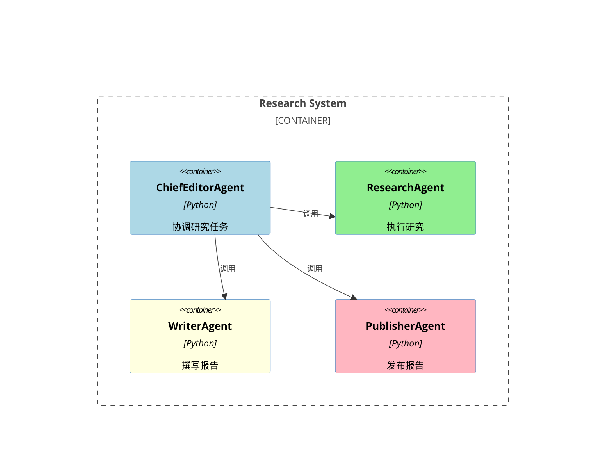

# 多代理研究者架构

## 核心原理
多代理研究者架构通过多个专用代理（如编辑、研究、撰写等）协同工作，自动化研究报告的生成过程。每个代理负责特定任务，确保高效和准确的研究输出。

## 模块详解

### 模块名称：ChiefEditorAgent
- **输入/输出**：接收任务配置，输出研究报告。
- **实现原理**：初始化多个代理（如ResearchAgent、WriterAgent等），创建工作流图（StateGraph）以协调代理间的任务流。通过异步调用实现并行研究和报告生成。
- **核心代码伪代码**：
    ```python
    class ChiefEditorAgent:
        def __init__(self, task, websocket=None, stream_output=None):
            self.task = task
            self.websocket = websocket
            self.stream_output = stream_output
            self.agents = self._initialize_agents()

        def _initialize_agents(self):
            return {
                "writer": WriterAgent(),
                "editor": EditorAgent(),
                "research": ResearchAgent(),
                "publisher": PublisherAgent(),
                "human": HumanAgent()
            }

        def _create_workflow(self):
            workflow = StateGraph(ResearchState)
            workflow.add_node("researcher", self.agents["research"].run_initial_research)
            workflow.add_node("writer", self.agents["writer"].run)
            workflow.set_entry_point("researcher")
            return workflow

        async def run_research_task(self):
            workflow = self._create_workflow()
            result = await workflow.ainvoke({"task": self.task})
            return result
    ```

## Mermaid 流程图


## 补充说明
在实现过程中，需注意各代理间的异步通信和数据共享，以确保任务的顺利进行和结果的准确性。特别是在并行研究阶段，需合理分配任务以避免资源冲突。
